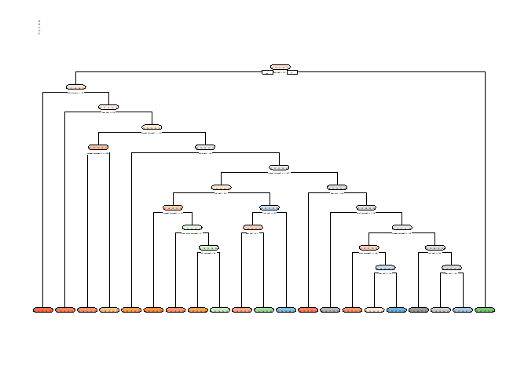
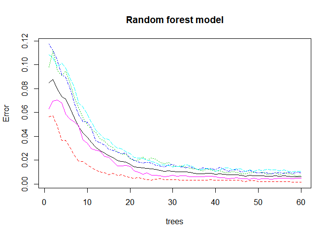

Machine Learning final project
================
R S
October 28, 2018

``` r
setwd("C:\\Coursera\\MachineLearning")
```

Executive Summary
=================

In this project we determine the quality or the manner of different type of exercises. First, we load the data sets then we process the data and making it ready for analysis. Creating two different models random forest and decision tree to determine which model will fit best the data. The random forest shows a more precise prediction. In the classe variable we have five group of exercises, A, B, C, D and E which correspond with activities: accelerometers on the belt, forearm, arm, and dumbell. After running the model on testing2 data set we get accuracy of 99.32%. "The goal of your project is to predict the manner in which they did the exercise. This is the "classe" variable in the training set. You may use any of the other variables to predict with. You should create a report describing how you built your model, how you used cross validation, what you think the expected out of sample error is, and why you made the choices you did. You will also use your prediction model to predict 20 different test cases."

Loading the data sets
=====================

``` r
testing = read.csv("pml-testing.csv")
training = read.csv("pml-training.csv")
```

Loading libraries
=================

``` r
library(rattle)
```

    ## Rattle: A free graphical interface for data science with R.
    ## Version 5.2.0 Copyright (c) 2006-2018 Togaware Pty Ltd.
    ## Type 'rattle()' to shake, rattle, and roll your data.

``` r
library(randomForest)
```

    ## randomForest 4.6-14

    ## Type rfNews() to see new features/changes/bug fixes.

    ## 
    ## Attaching package: 'randomForest'

    ## The following object is masked from 'package:rattle':
    ## 
    ##     importance

``` r
library(rpart)
library("rpart.plot")
library(caTools)
library(caret)
```

    ## Loading required package: lattice

    ## Loading required package: ggplot2

    ## 
    ## Attaching package: 'ggplot2'

    ## The following object is masked from 'package:randomForest':
    ## 
    ##     margin

Removing the first 7 columns which we don't need for this analysis.
===================================================================

Creating new data sets. Also removing NA columns by NAcolremove function.

``` r
testing <- testing[,-c(1:7)]
training <- training[,-c(1:7)]

newtraining1 <- training
newtesting1 <- testing
```

Removing columns the contains more than 80% NA data

``` r
NAcolremove <- function(data){
  
  rem <- which(colSums(data =="" | is.na(data))>0.8*nrow(data)) 
  
  data <- data[,-rem]
}

newtraining1 <-NAcolremove(newtraining1)
newtesting1 <-NAcolremove(newtesting1)
```

Creating new testing and training sets
======================================

``` r
set.seed(12345)
sample1 <-createDataPartition(y=newtraining1$classe,p=0.75,list=FALSE)
training2<-newtraining1[sample1,]
testing2<-newtraining1[-sample1,]
```

Creating decision tree regression model
=======================================

``` r
tree_mod <- rpart(formula = classe ~ . , 
                  data = training2, 
                  control = rpart.control(minisplit = 1))

tree_predict <- predict(tree_mod, testing2, type = "class")
tree_ConfMat<- confusionMatrix(tree_predict, testing2$classe)
tree_ConfMat
```

    ## Confusion Matrix and Statistics
    ## 
    ##           Reference
    ## Prediction    A    B    C    D    E
    ##          A 1260  156   33   40   23
    ##          B   52  555   73   52   52
    ##          C   24  136  575   83   95
    ##          D   40   33  150  513   89
    ##          E   19   69   24  116  642
    ## 
    ## Overall Statistics
    ##                                           
    ##                Accuracy : 0.7229          
    ##                  95% CI : (0.7101, 0.7354)
    ##     No Information Rate : 0.2845          
    ##     P-Value [Acc > NIR] : < 2.2e-16       
    ##                                           
    ##                   Kappa : 0.6486          
    ##  Mcnemar's Test P-Value : < 2.2e-16       
    ## 
    ## Statistics by Class:
    ## 
    ##                      Class: A Class: B Class: C Class: D Class: E
    ## Sensitivity            0.9032   0.5848   0.6725   0.6381   0.7125
    ## Specificity            0.9282   0.9421   0.9165   0.9239   0.9430
    ## Pos Pred Value         0.8333   0.7079   0.6298   0.6218   0.7379
    ## Neg Pred Value         0.9602   0.9044   0.9298   0.9287   0.9358
    ## Prevalence             0.2845   0.1935   0.1743   0.1639   0.1837
    ## Detection Rate         0.2569   0.1132   0.1173   0.1046   0.1309
    ## Detection Prevalence   0.3083   0.1599   0.1862   0.1682   0.1774
    ## Balanced Accuracy      0.9157   0.7635   0.7945   0.7810   0.8278

``` r
rpart.plot(tree_mod, extra = 5)
```



``` r
tree_ConfMat$overall[1]
```

    ##  Accuracy 
    ## 0.7228793

Random forest model
===================

``` r
rf_mod <- randomForest(classe ~ ., data=training2, ntree =60)

rf_predict <- predict(rf_mod, training2, type = "class")

rf_ConfMat<- confusionMatrix(rf_predict, training2$classe)
plot(rf_mod, main = "Random forest model")
```



``` r
rf_ConfMat
```

    ## Confusion Matrix and Statistics
    ## 
    ##           Reference
    ## Prediction    A    B    C    D    E
    ##          A 4185    0    0    0    0
    ##          B    0 2848    0    0    0
    ##          C    0    0 2567    0    0
    ##          D    0    0    0 2412    0
    ##          E    0    0    0    0 2706
    ## 
    ## Overall Statistics
    ##                                      
    ##                Accuracy : 1          
    ##                  95% CI : (0.9997, 1)
    ##     No Information Rate : 0.2843     
    ##     P-Value [Acc > NIR] : < 2.2e-16  
    ##                                      
    ##                   Kappa : 1          
    ##  Mcnemar's Test P-Value : NA         
    ## 
    ## Statistics by Class:
    ## 
    ##                      Class: A Class: B Class: C Class: D Class: E
    ## Sensitivity            1.0000   1.0000   1.0000   1.0000   1.0000
    ## Specificity            1.0000   1.0000   1.0000   1.0000   1.0000
    ## Pos Pred Value         1.0000   1.0000   1.0000   1.0000   1.0000
    ## Neg Pred Value         1.0000   1.0000   1.0000   1.0000   1.0000
    ## Prevalence             0.2843   0.1935   0.1744   0.1639   0.1839
    ## Detection Rate         0.2843   0.1935   0.1744   0.1639   0.1839
    ## Detection Prevalence   0.2843   0.1935   0.1744   0.1639   0.1839
    ## Balanced Accuracy      1.0000   1.0000   1.0000   1.0000   1.0000

``` r
rf_ConfMat$table
```

    ##           Reference
    ## Prediction    A    B    C    D    E
    ##          A 4185    0    0    0    0
    ##          B    0 2848    0    0    0
    ##          C    0    0 2567    0    0
    ##          D    0    0    0 2412    0
    ##          E    0    0    0    0 2706

``` r
rf_ConfMat$overall[1]
```

    ## Accuracy 
    ##        1

Cross validation through random forest model
============================================

``` r
rf_mod1 <- randomForest(classe ~ ., data=training2, ntree =60)

rf_predict1 <- predict(rf_mod1, testing2, type = "class")

rf_ConfMat1<- confusionMatrix(rf_predict1, testing2$classe)
rf_ConfMat1
```

    ## Confusion Matrix and Statistics
    ## 
    ##           Reference
    ## Prediction    A    B    C    D    E
    ##          A 1394    8    0    0    0
    ##          B    1  937    4    0    0
    ##          C    0    4  849    8    2
    ##          D    0    0    2  796    4
    ##          E    0    0    0    0  895
    ## 
    ## Overall Statistics
    ##                                           
    ##                Accuracy : 0.9933          
    ##                  95% CI : (0.9906, 0.9954)
    ##     No Information Rate : 0.2845          
    ##     P-Value [Acc > NIR] : < 2.2e-16       
    ##                                           
    ##                   Kappa : 0.9915          
    ##  Mcnemar's Test P-Value : NA              
    ## 
    ## Statistics by Class:
    ## 
    ##                      Class: A Class: B Class: C Class: D Class: E
    ## Sensitivity            0.9993   0.9874   0.9930   0.9900   0.9933
    ## Specificity            0.9977   0.9987   0.9965   0.9985   1.0000
    ## Pos Pred Value         0.9943   0.9947   0.9838   0.9925   1.0000
    ## Neg Pred Value         0.9997   0.9970   0.9985   0.9980   0.9985
    ## Prevalence             0.2845   0.1935   0.1743   0.1639   0.1837
    ## Detection Rate         0.2843   0.1911   0.1731   0.1623   0.1825
    ## Detection Prevalence   0.2859   0.1921   0.1760   0.1635   0.1825
    ## Balanced Accuracy      0.9985   0.9930   0.9948   0.9943   0.9967

``` r
rf_ConfMat1$table
```

    ##           Reference
    ## Prediction    A    B    C    D    E
    ##          A 1394    8    0    0    0
    ##          B    1  937    4    0    0
    ##          C    0    4  849    8    2
    ##          D    0    0    2  796    4
    ##          E    0    0    0    0  895

``` r
rf_ConfMat1$overall[1]
```

    ##  Accuracy 
    ## 0.9932708

Accuracy equals to 99.32% on 60 trees which runs faster and give decent accuracy.
